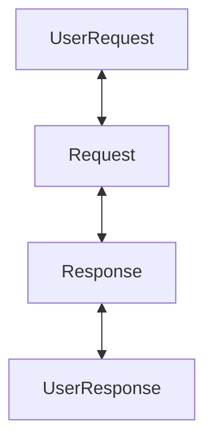

# Proto-Kafka

Kafka is a message broker.
Current work is included in [kafkad-rs](https://github.com/rapidrecast/kafkad-rs)

## Adding dependency to project

```toml
[dependencies]
proto-kafka = { git = "https://github.com/rapidrecast/proto-tower.git", subdir = "proto-kafka" }
```

## Implementation details

